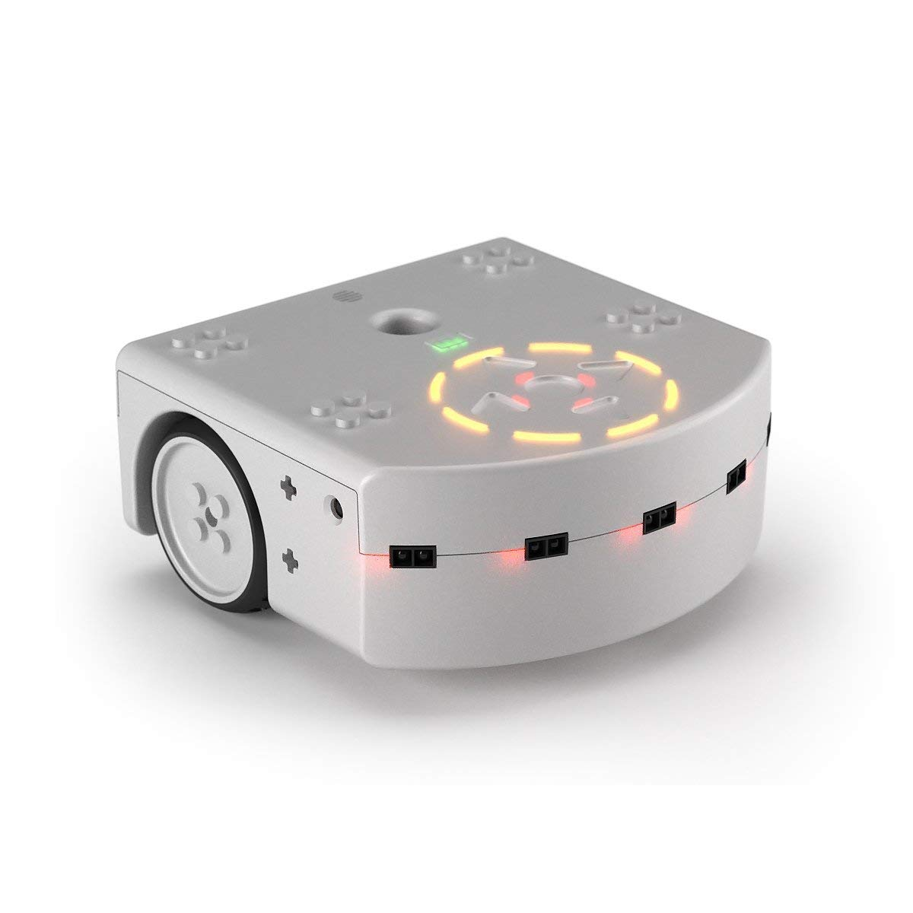

# Mobile-Robotics-Thymio-project
Sensing, Vision, Navigation, Kalman Filtering over a differential drive robot. Project for the EPFL course Basics of Mobile Robotics of Prof. F. Mondada. Autumn 2023

